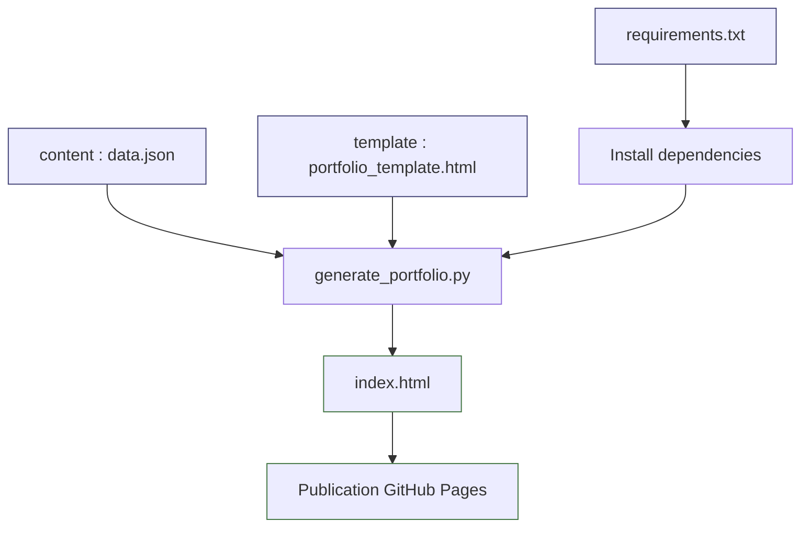

# CV on GitHub Pages

This project automatically generates a static portfolio page (`index.html`) from a JSON data file and a Jinja2 HTML template.

## Workflow overview



## Useful project files

- `data.json`: portfolio data (profile, experience, projects, etc.)
- `portfolio_template.html`: Jinja2 template used to render HTML
- `generate_portfolio.py`: Python script that reads data and generates the page
- `requirements.txt`: Python dependencies
- `index.html`: generated file (final output)

## Prerequisites

Before running the project, install:

- Python 3.9+
- `pip`

Then install the project dependencies:

```bash
python3 -m pip install -r requirements.txt
```

> Current dependency: `jinja2>=3.1.0`

## How to generate the HTML file

From the `cv-on-githubpages/` folder:

```bash
python3 generate_portfolio.py
```

This command uses default values:

- Data: `data.json`
- Template: `portfolio_template.html`
- Output: `index.html`

### Example with custom paths

```bash
python3 generate_portfolio.py \
  --data data.json \
  --template portfolio_template.html \
  --output index.html
```

## How the file is generated (details)

The `generate_portfolio.py` script:

1. Reads CLI arguments (`--data`, `--template`, `--output`).
2. Loads and parses JSON from `data.json`.
3. Applies default values (title, description, empty lists when missing).
4. Converts `Programming Languages` into `programming_languages` for the template.
5. Adds `current_year` automatically.
6. Renders the Jinja2 template with the data.
7. Writes the final result to `index.html`.

## Quick check

After generation:

- Open `index.html` in a browser
- Verify that referenced images (`image/...`) exist
- Confirm GitHub/LinkedIn links are correct

## GitHub Pages publishing (summary)

- Commit/push the repo content with an up-to-date `index.html`.
- Enable GitHub Pages on your target branch/folder (usually `main` / root).
- GitHub will directly serve `index.html`.
